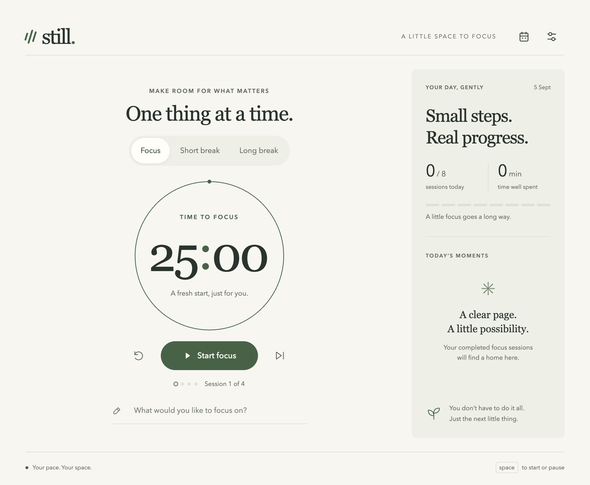

# Still

A little space to focus. An offline Pomodoro desktop app for macOS, Windows, and Linux.



## A quiet, useful timer

- Focus, short break, and long break sessions; a long break after four completed focus sessions by default.
- Start, pause, resume, reset, or skip. Skips don't count toward your progress.
- One focus intention, a daily session goal, focused minutes, and your five most recent sessions today.
- Custom session lengths (1–120 minutes), long-break interval, and daily goal.
- Light, dark, and system appearance; optional completion chime and native notifications.
- Optional automatic session starts and always-on-top window.
- Menu bar/system tray controls. Closing the window leaves the timer running; use **Quit Still** to exit.
- Local preferences and session history. No accounts, analytics, network requests, or cloud service.

## Run locally

Use Node.js 24 LTS or newer and npm:

```sh
npm ci
npm start
```

Shortcuts while the timer workspace has focus: **Space** starts/pauses, **R** resets, **S** skips. **⌘/Ctrl + ,** opens preferences. Native text editing and button keyboard behavior stay intact.

## Installers

```sh
npm run dist:mac    # macOS: Apple Silicon + Intel DMG and ZIP
npm run dist:win    # Windows: x64 setup EXE
npm run dist:linux  # Linux: x64 AppImage
```

Outputs are written to `dist/`. Build on the target OS for the most reliable results. The included GitHub Actions workflow runs tests and produces downloadable installer artifacts for all three systems on pushes to `main`, tags, pull requests, or manual dispatch. Creating this local repository does not publish it to GitHub or run that workflow.

- **macOS:** open the DMG and drag Still into Applications.
- **Windows:** run the setup EXE; choose your installation location.
- **Linux:** make the AppImage executable and run it. AppImage requires a compatible FUSE runtime.

macOS builds use a local ad-hoc signature (`mac.identity: "-"`) so the packaged app has a valid resource seal; they are **not Developer ID signed or notarized**. Windows builds are unsigned. For normal distribution, replace the ad-hoc identity with Developer ID signing and notarization credentials, and configure Windows signing to establish a publisher identity. The workflow disables automatic certificate discovery. See [Electron Builder signing](https://www.electron.build/code-signing.html) to configure signed distribution.

Native notifications follow operating-system notification permissions and Do Not Disturb settings. A sleeping computer cannot play a chime or show an alert until it wakes.

## Timer and data behavior

The timer lives in Electron's main process, with a wall-clock deadline rather than a decrementing counter. It keeps time when minimized, hidden, or asleep. An overdue session completes on wake or the next launch, and is credited to its original deadline's local calendar day. If auto-start is enabled, the next session starts at recovery time; Still never invents a series of completed sessions while you're away. Changing the system clock affects wall-clock timers.

Quit saves the deadline; launching again resumes or completes that session. Paused sessions stay paused. Changing durations doesn't alter a running or paused session; reset or the next session uses the new duration. Switching session types resets the current countdown. A focus intention remains until you edit it.

State is atomically replaced in `still-state.json` in Electron's per-user app-data directory (normally `~/Library/Application Support/Still` on macOS, `%APPDATA%/Still` on Windows, and `~/.config/Still` on Linux). The most recent 2,000 completed sessions are retained; the UI shows today's totals and last five sessions. Invalid JSON is backed up before recovery. If a write fails, the app visibly reports that changes aren't saved.

## Verify

```sh
npm test          # deterministic timer, recovery, input validation, local-day accounting
npm run test:app  # real Electron UI, settings, restart, session completion, security, resizing
```

The desktop check uses an isolated temporary app-data directory and writes screenshots to `artifacts/`. Linux CI requires a display, provided by `xvfb-run --auto-servernum npm run test:app`. Packaged installers need testing on their target OS in addition to these checks.

## Implementation

Plain HTML/CSS/JavaScript, Electron, and Electron Builder. No frontend build step or runtime UI dependencies. The renderer is sandboxed with context isolation and a small validated IPC interface; external navigation and new windows are disabled. See [Electron security guidance](https://www.electronjs.org/docs/latest/tutorial/security) and [multi-platform packaging](https://www.electron.build/multi-platform-build.html).

- `src/timer.cjs` — timer state, validation, transitions, and statistics.
- `src/main.cjs` — window, persistence, tray, notifications, and IPC.
- `src/preload.cjs` — narrowly scoped desktop bridge.
- `src/index.html`, `src/style.css`, `src/renderer.js` — interface.
- `test/` — timer and desktop checks.
